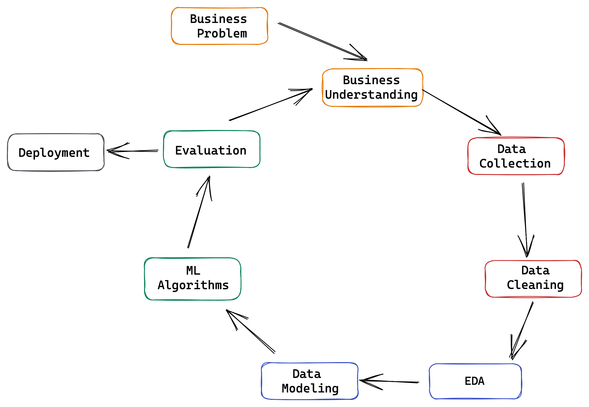

# Rossmann Sales Predict

# Business Problem

Rossmann GmbH is one of the largest drug store chains in Europe with around 56,200 employee and around 4,000 stores. After a weekly meeting with Rossmann's CFO, some store managers came to me proposing a sales forecast project to predict how much their stores are going to sell in the next 6 weeks. The core reason for this project is to support the CFO in deciding which stores to renovate based on estimated sales.

# Business Assumptions

The data available for the project correspond to a period of 30 months of company sales. Several details were provided, such as store type, variety of products offered, the competition distance, sales per day, holidays, marketing promotions and so on.

To better understand the data behaviour and fit the data for the models, I have to assume some things, as you can see below:

- **Competition Distance:** It is expressed in meters but, some rows was zero. So I assume that zero competition distance is the same as there are no competitiors close to the store. But, this zero values will cause bias in the ML models, so to fix this problem I assumed a fixed value (100,000 meters) higher than the highest value in dataset.
- **Assorment:** I assumed there is a hierarchy between the assortment types. So, stores that has assortment type C must offer types A and B too.
- **Store Open:** As we had zero sales in days that stores were closed, I removed all records with store open status "closed".
- **Sales Prediction:** In agreement with the CFO, I presumed they would provide the total sales for each store at the end of the sixth weeks.

My strategy to solve this challenge was based in CRISP-DM Cycle:

# Machine Learning Models and Metrics

Machine Learning is the focus of the Rossmann project, because here is where we are going to find some interesting assumptions over the data and really predict what the CFO need. I tested four Machine Learning Algorithms: Linear Regression, Lasso Regression, Random Forest Regression and XGBoost Regressor. To understand the algorithms performance I used 3 different metrics: MAE, MAPE and RMSE.

Bellow I leave the results for each model after cross validation:

|       Model Name          |        MAE CV       |     MAPE CV    |      RMSE CV       |
|:-------------------------:|:-------------------:|:--------------:|:------------------:|
| Linear Regression         |  2081.73 +/- 295.63 | 30.26 +/- 1.66 | 2952.52 +/- 468.37 |
| Lasso Regression          |  2116.38 +/- 341.58 | 29.2  +/- 1.18 | 3057.75 +/- 504.26 |
| Random Forest Regressor   |  836.89  +/- 217.42 | 11.61 +/- 2.32 | 1254.75 +/- 316.61 |
| XGBoost Regressor         |  2889.54 +/- 588.52 | 34.54 +/- 1.39 | 3714.69 +/- 456.1  |

I choose to follow the first cycle of CRISP with XGBoost even with worse performance, because the CFO requested that the project no go beyond the budget already defined for the analytics area and all Machine Learning projects have to be aligned with budget.

The main concern here is to not overload our servers with a heavy model when put this into production. So I assumed the following questions to choose XGBoost:

- Can the final model be sustained by the business infrastructure?
- Do the results (direct or indirect) affect or are affected by any internalcompany policy?

In this case, the model will be hosted on a free cloud (Heroku) where we have a space limitation. Random Forest has a size estimated in 1GB, meanwhile the XGBoost is much smaller with a size around 300MB.

After Hyperparameter Fine Tuning with Random Search, the metric problem was solved, increasing a lot the model metrics MAE, MAPE and RMSE.

|    Model Name        |     MAE      |    MAPE%    |     RMSE       |
|:--------------------:|:------------:|:-----------:|:--------------:|
|  XGBoost Regressor   |   703.3284   |   10.3164   |   1,016.1218   |
#
After Hyperparameter we had a RMSE better than Random Forest.

# Business Results

We made a really good progress until now, but only show metrics to the CFO will not help him to understand the model and put the main reason in practice. So bellow I converted the metrics into real business results.

The table bellow shows the TOTAL (in USD) of predictions. Considering the best and wors scenarios.

|   Scenario     |      Values      |
|:--------------:|:----------------:|
| predictions    | $ 283,456,064.00 |
| worst_scenario | $ 282,668,127.02 |
| best_scenario  | $ 284,244,032.67 |
#
Below we have a scatter plot with all predictions. Notice that most are centered around a lone parallel to the X axis and MAPEa around 11% in Y axixs. But, there are point far apart, this is because these are stores for which the forecasts are not so accurate.

#
With all this said, what does this deviation really represent?

Check the table for the 5 best cases:

|store|predictions|worst_scenario|best_scenario|MAE|MAPE|
|-----|-----------|--------------|-------------|---|----|
|1089|373,394.1875|372,825.1184|373,963.2566|569.07|5.3232|
|667 |315,185.8438|314,693.4028|315,678.2847|492.44|5.5487|
|323 |282,916.4688|282,488.0610|283,344.8765|428.41|5.6277|
|742 |301,657.5312|301,199.1451|302,115.9174|458.39|5.6393|
|1097|450,342.1562|449,703.2118|450,981.1007|638.94|5.7761|

And the 5 worst cases:

|store|predictions |worst_scenario|best_scenario|MAE    |MAPE   |
|-----|------------|--------------|-------------|-------|-------|
|292  |107,567.9375|104,245.3016  |110,890.5733 |3322.64|60.2768|
|909  |232,030.0781|224,319.9419  |239,740.2142 |7710.14|51.8675|
|876  |198,517.5312|194,561.8566  |202,473.2058 |3955.67|33.7730|
|956  |136,210.0937|135,548.4395  |136,871.7479 |661.65 |33.2923|
|675  |156,688.7968|155,881.2358  |157,496.3579 |807.56 |28.3049|

# Lessons Learned

# What to do in the next cycle?

- Test different Machine Learning models
- Build a pipeline to retrain model
- Get more data
